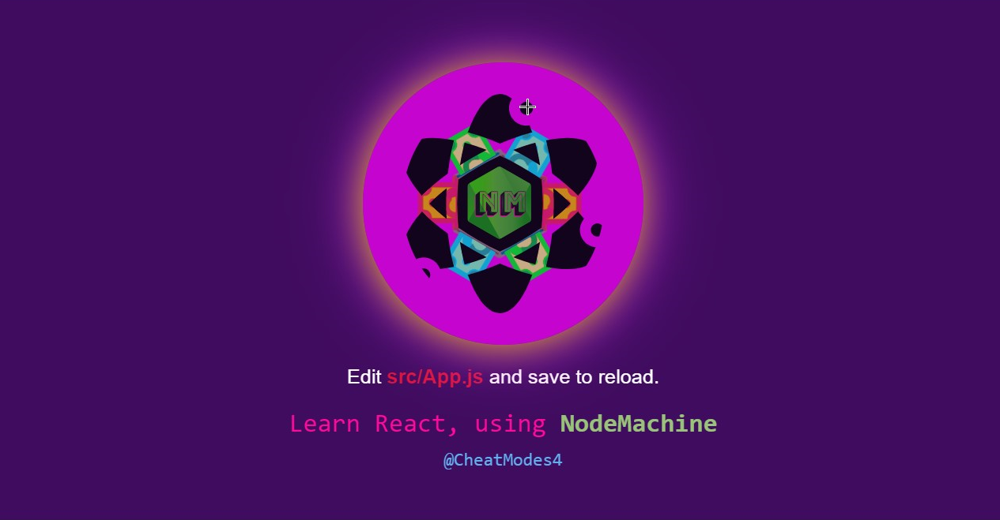
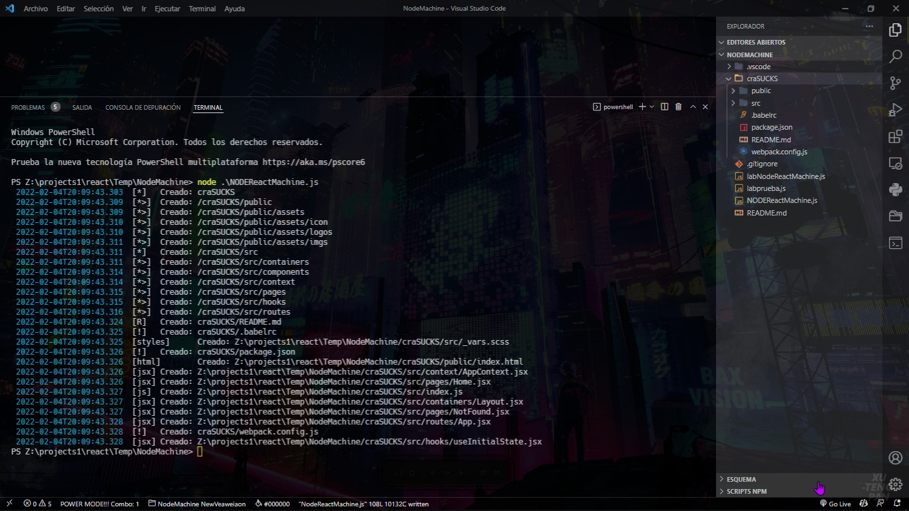
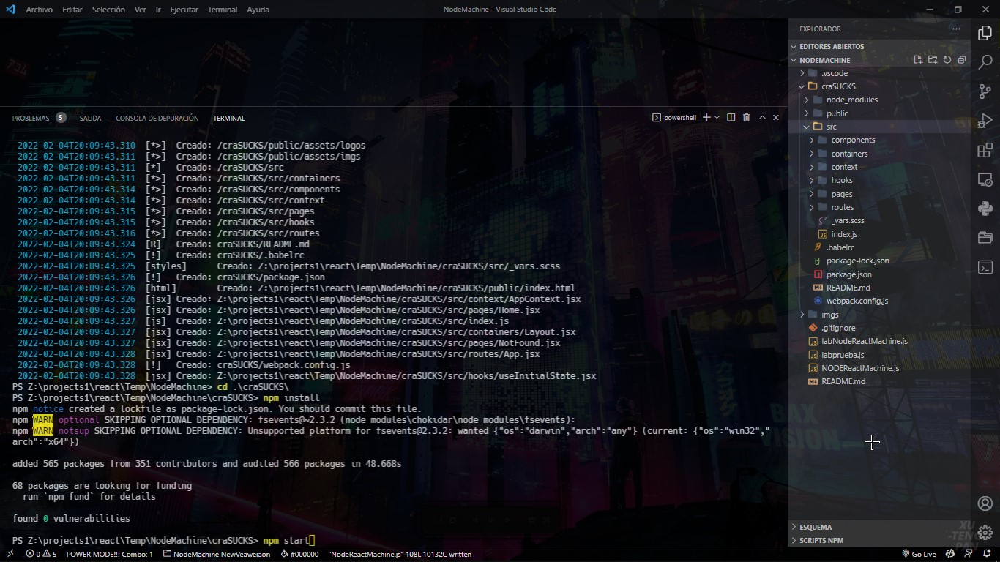
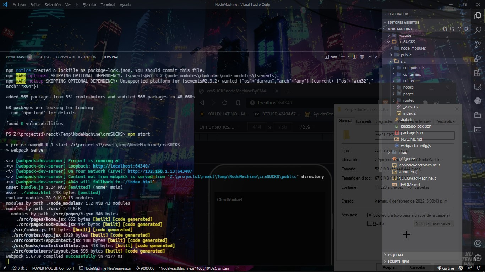

# Node React Machine 
<div style="display: grid; place-content: center">
<p align="center">
  <a aria-label="NodeMachine" href="https://twitter.com/cheatmodes4">
    
  </a>
  <p aria-label="License" href="https://github.com/vercel/next.js/blob/canary/license.md">
    
  </p>
  <p aria-label="React Version" href="https://github.com/vercel/next.js/discussions">
    
  </p>
  <p aria-label="Webpack Version" href="https://github.com/vercel/next.js/discussions">
    
  </p>
  <p aria-label="Join the community on GitHub" href="https://github.com/vercel/next.js/discussions">
    
  </p>
</p>
</div>

```sh
$ node NODEReactMachine0.0.4.js
```
> Al ejecutar este archivo con node desde la consola creara un proyecto ReacJs, Webpack y babel.

> Posteriormente solo queda entrar con el comando cd a la carpeta que te acaba de crear del proyecto e instalar las dependecias con el comando npm install y correr el servidor.

```ts
/**
 * en_US
 * @Raiz entry point - when you start the project check localhost:64340/@Raiz
 * ? Ej: entry point - when you start the project check:
 * ! localhost:64340/nameproject
 * @Port if you want to change the port of the project check package.json
 */
```
```ts
/**
 * en_ES
 * @Raiz este es el punto de entrada o nombre del projecto
 * ? Por defecto el projecto corre en:
 * ! localhost:64340/nameproject
 * ? Si lo quieres cambiar cambia el valor de @Raiz
 * @Port El puerto se cambia en package.json
 */
```
```sh
$ npm install
$ npm start
$ now your project run in localhost:64340/projectname
```
#### Con un peso final en disco: 70mb aproximadamente.
## Size disk: 70mb.





